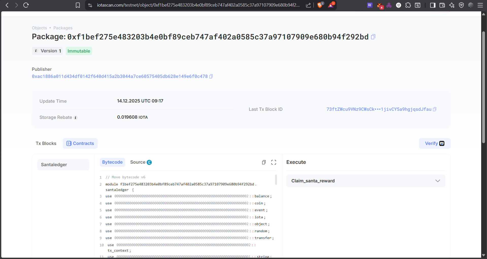

# 🎅 Santa Ledger

A blockchain-based good and bad deeds tracking system built on the IOTA network. Santa Ledger allows users to record their deeds, have others report on their behavior, and claim randomized rewards based on their good deed ratio.

## Contract Address

```
0xac1886a011d434df0142f640d415a2b3044a7ce60575405db628e149e6f0c478
```



## 📖 Overview

Santa Ledger is a decentralized application that gamifies good behavior by:

- Tracking good and bad deeds on the blockchain
- Allowing peer reporting and self-reporting of deeds
- Providing probabilistic rewards based on good deed percentage
- Using verifiable randomness for fair reward distribution

## ✨ Features

### Core Functionality

- **Deed Recording**: Users can record their own good or bad deeds
- **Peer Reporting**: Other users can report deeds for someone
- **Reward System**: Probabilistic rewards based on good deed ratio
- **Transparent Tracking**: All deeds recorded on-chain with timestamps
- **Fair Randomness**: Uses IOTA's on-chain randomness for reward claims

### Security Features

- Owner-only ledger modifications
- Admin-controlled reward pool
- Protected randomness (entry function to prevent manipulation)
- Authorization checks on all sensitive operations

## 🏗️ Architecture

### Smart Contract Structure

```
santaledger
├── Deed (struct)           - Individual deed record
├── UserLedger (struct)     - User's personal ledger
├── SantaRegistry (struct)  - Shared registry with reward pool
└── Functions
    ├── create_ledger()              - Create new user ledger
    ├── record_self_deed()           - Record own deed
    ├── report_deed()                - Report deed for others
    ├── claim_santa_reward()         - Claim rewards (randomized)
    ├── fund_reward_pool()           - Admin funds the pool
    └── withdraw_rewards()           - Withdraw earned rewards
```

### Data Structures

#### Deed

```move
public struct Deed {
    description: String,    // Description of the deed
    is_good: bool,         // True = good deed, False = bad deed
    reported_by: address,  // Who reported this deed
    timestamp: u64,        // When it was recorded (epoch)
}
```

#### UserLedger

```move
public struct UserLedger {
    id: UID,
    owner: address,              // Ledger owner
    deeds: vector<Deed>,         // List of all deeds
    good_count: u64,             // Count of good deeds
    bad_count: u64,              // Count of bad deeds
    reward_balance: Balance<IOTA>, // Accumulated rewards
}
```

#### SantaRegistry

```move
public struct SantaRegistry {
    id: UID,
    admin: address,              // Admin address
    reward_pool: Balance<IOTA>,  // Pool for distributing rewards
}
```

## 🎲 Reward Mechanism

### How Rewards Work

1. **Probability-Based**: Your chance of winning = `good_deeds / total_deeds`

   - Example: 8 good deeds out of 10 total = 80% chance to win

2. **Reward Calculation**:

   ```
   reward_amount = (good_count * 100 / total_deeds) * 1000 MIST
   ```

   - 100% good deeds = 100,000 MIST (0.0001 IOTA)
   - 80% good deeds = 80,000 MIST (0.00008 IOTA)
   - 50% good deeds = 50,000 MIST (0.00005 IOTA)

3. **Random Selection**: Uses IOTA's verifiable randomness
   - Generates random number between 0 and total_deeds
   - If random_num < good_count, user wins the reward

## 🚀 Getting Started

### Prerequisites

- IOTA CLI installed
- IOTA wallet with testnet tokens
- Move compiler

### Installation

1. **Clone the repository**

   ```bash
   git clone <your-repo-url>
   cd santaledger
   ```

2. **Build the contract**

   ```bash
   iota move build
   ```

3. **Run tests** (optional)
   ```bash
   iota move test
   ```

### Deployment

1. **Setup testnet environment**

   ```bash
   # Switch to testnet
   iota client switch --env testnet

   # Request testnet tokens
   iota client faucet

   # Check balance
   iota client balance
   ```

2. **Deploy the contract**

   ```bash
   iota client publish --gas-budget 100000000
   ```

3. **Save the output**
   - `Package ID`: Your contract's address
   - `SantaRegistry Object ID`: Shared registry object

## 📝 Usage Examples

### Create a User Ledger

```bash
iota client call \
  --package <PACKAGE_ID> \
  --module santaledger \
  --function create_and_transfer_ledger \
  --gas-budget 10000000
```

### Record a Good Deed

```bash
iota client call \
  --package <PACKAGE_ID> \
  --module santaledger \
  --function record_self_deed \
  --args <LEDGER_OBJECT_ID> "Helped an elderly person cross the street" true \
  --gas-budget 10000000
```

### Report Someone's Deed

```bash
iota client call \
  --package <PACKAGE_ID> \
  --module santaledger \
  --function report_deed \
  --args <THEIR_LEDGER_ID> "Donated to charity" true \
  --gas-budget 10000000
```

### Fund Reward Pool (Admin Only)

```bash
iota client call \
  --package <PACKAGE_ID> \
  --module santaledger \
  --function fund_reward_pool \
  --args <REGISTRY_ID> <COIN_OBJECT_ID> \
  --gas-budget 10000000
```

### Claim Rewards

```bash
iota client call \
  --package <PACKAGE_ID> \
  --module santaledger \
  --function claim_santa_reward \
  --args <LEDGER_OBJECT_ID> <REGISTRY_ID> 0x8 \
  --gas-budget 10000000
```

_Note: `0x8` is the Random object on IOTA testnet_

### Withdraw Rewards

```bash
iota client call \
  --package <PACKAGE_ID> \
  --module santaledger \
  --function withdraw_rewards \
  --args <LEDGER_OBJECT_ID> <AMOUNT_IN_MIST> \
  --gas-budget 10000000
```

## 🔍 View Functions

Query your ledger data:

```bash
# Get deed counts (good, bad)
iota client call \
  --package <PACKAGE_ID> \
  --module santaledger \
  --function get_deed_counts \
  --args <LEDGER_OBJECT_ID>

# Get total deeds
iota client call \
  --package <PACKAGE_ID> \
  --module santaledger \
  --function get_total_deeds \
  --args <LEDGER_OBJECT_ID>

# Get reward balance
iota client call \
  --package <PACKAGE_ID> \
  --module santaledger \
  --function get_reward_balance \
  --args <LEDGER_OBJECT_ID>

# Calculate winning probability (returns percentage * 100)
iota client call \
  --package <PACKAGE_ID> \
  --module santaledger \
  --function calculate_good_probability \
  --args <LEDGER_OBJECT_ID>
```

## 🔐 Security Considerations

### Authorization

- Only ledger owners can record their own deeds
- Only admin can fund the reward pool
- Only owners can withdraw their rewards

### Randomness Protection

- `claim_santa_reward` is an entry function (not composable)
- Prevents attackers from simulating outcomes before submission
- Uses IOTA's verifiable on-chain randomness

### Error Handling

- `EInvalidDeedType`: Attempting to claim with no deeds
- `ENotAuthorized`: Unauthorized access attempt
- `EInsufficientBalance`: Insufficient balance for withdrawal

## 🧪 Testing

Run the test suite:

```bash
iota move test
```

Create test scenarios:

1. Create multiple user ledgers
2. Record various deeds
3. Test peer reporting
4. Test reward claims with different ratios
5. Verify authorization checks

## 📊 Contract Economics

### Token Flow

```
Admin → fund_reward_pool() → SantaRegistry
                                    ↓
User → claim_santa_reward() → UserLedger.reward_balance
                                    ↓
User → withdraw_rewards() → User's Wallet
```

### Gas Costs (Approximate)

- Create Ledger: ~0.001 IOTA
- Record Deed: ~0.0005 IOTA
- Claim Reward: ~0.001 IOTA
- Withdraw: ~0.0005 IOTA
